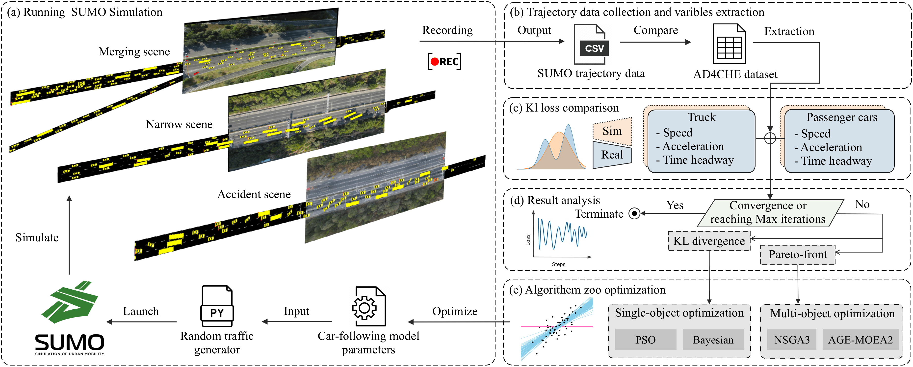
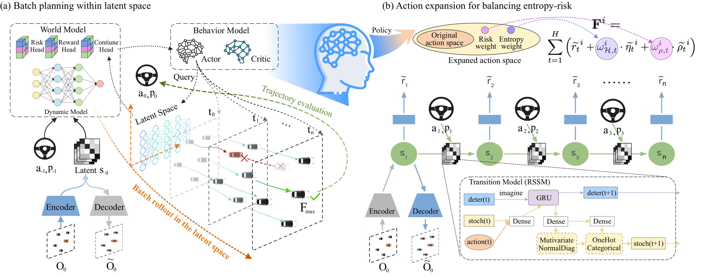
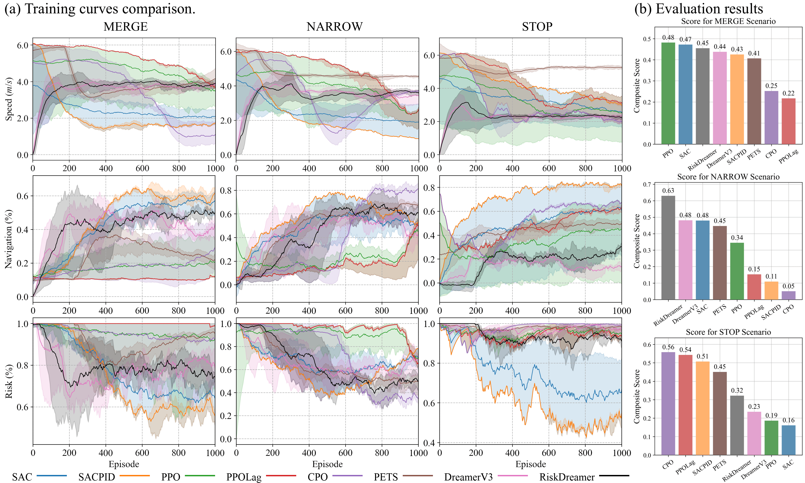
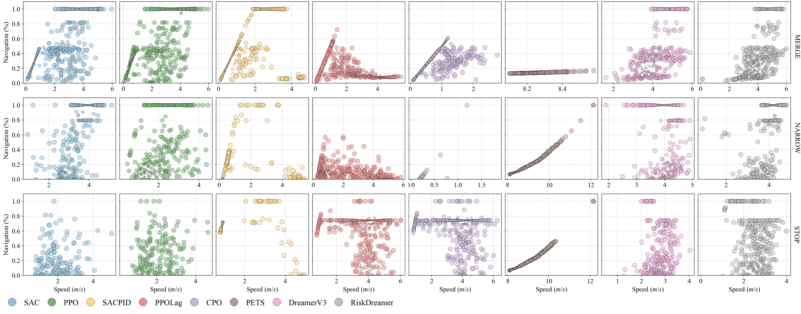

# RiskDreamer: Autonomous Driving via Entropy-Risk Balancing Action Expansion in Batch Planning with Trusted Traffic Simulations

some 徽章 

帮我写 单位超链接 Jiangsu University & Nanyang Technological University

Qingchao Liu, Chengzhi Gao, Xiangkun He, Hai Wang, Chen Lv, Yingfeng Cai, Long Chen

下面排成一行居中
[paper](https://github.com/Gaochengzhi/IEEE_template)
[code1](https://github.com/Gaochengzhi/sumo_bayesian_calibration)
[code2](https://github.com/Gaochengzhi/RiskDreamer)
[data](https://github.com/ADSafetyJointLab/AD4CHE)
[model](https://huggingface.co/taitanpascal/riskdreamer_model)

## Overview
***Abstract***: Ensuring safety and achieving human-level driving
performance remain significant challenges for autonomous vehi-
cles. While model-based reinforcement learning with planners en-
hances sample efficiency and **facilitates** policy exploration, many
such methods rely on planners employing fixed parameters to bal-
ance expected rewards and risks, which limits their adaptability
in dynamic traffic scenarios. Furthermore, studies use simplified
traffic simulations for training and evaluation often results in
algorithms that overfit to homogeneous traffic agents, resulting
in overly optimistic performance. To address these limitations, we
introduce RiskDreamer, a novel framework that employs batch
planning within the latent space of the world model. facilitating
efficiently exploration. Notably, we extend the action space to
incorporate balancing factors as direct action outputs, optimized
at each step. This enables the dynamic weighting of entropy, risk,
and expected reward, achieving adaptable behavior planning in
diverse traffic conditions. Furthermore, RiskDreamer is trained
within a trustworthy traffic scenario generation framework based
on optimization algorithms, capable of producing heterogeneous
traffic agents from real trajectory datasets. The microscopic
behavioral characteristics and macroscopic aggregate metrics of
the generated background agents align with real-world statistical
distributions. Through experimental results, we demonstrate that
our method achieve competitive performance compared to strong
baseline methods. 

## Framework

居中，白色背景
 
Calibration framework of the trustworthy traffic simulation

Framework of the RiskDreamer algorithm. (a) Batch planning within latent space. (b) Action expansion for balancing entropy-risk.

## Results

Results of different algorithm in the three scenarios. (a) Training curves comparison. (b) Evaluation results

Evaluation pattern of agent performance: Speed vs. Navigation. Bigger points indicate denser data point distributions.

